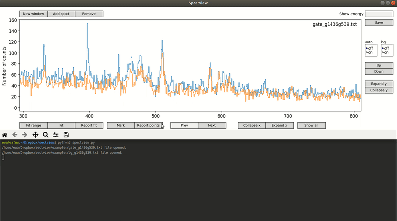

# spectview
Lorem ipsum.

# Dependencies
This application requires the following python3 packages:
* [numpy](http://www.numpy.org/)
* [matplotlib](http://matplotlib.org/)
* [lmfit](https://github.com/newville/lmfit-py)
         
### Dependencies installation
The needed packages can be installed with:
```
pip3 install -r requirements.txt
```
or
```
python3 setup.py build
sudo python3 setup.py install
```

# Usage


**spectview** can be controled by keyboard. The keymap is presented in the table below.


| Key        | Action           |
| ------------- |:-------------:|
| right arrow   | x axis view move right    |
| left arrow    | x axis view move left     |
| up arrow      | x axis view move up       |
| down arrow    | x axis view move down     |
| ctrl+up       | y axis expand scale       |
| ctrl+right    | x axis expand scale       |
| ctrl+left     | x axis collapse scale     |
| ctrl+down     | y axis collapse scale     |
| w             | open new window           |
| s             | save .svg                 |
| f             | activate marking mode for fit |
| g             | do fit                        |
| h             | report fit to file            |
| v             | activate marking mode         |
| b             | print marked points out       |
| r             | remove selected spectrum      |
| a             | add spectrum from file        |

---
## Author
Ewa Adamska

[Ewa.Adamska@fuw.edu.pl](Ewa.Adamska@fuw.edu.pl)


This project is licensed under the MIT License - see the [LICENSE.md](LICENSE.md) file for details