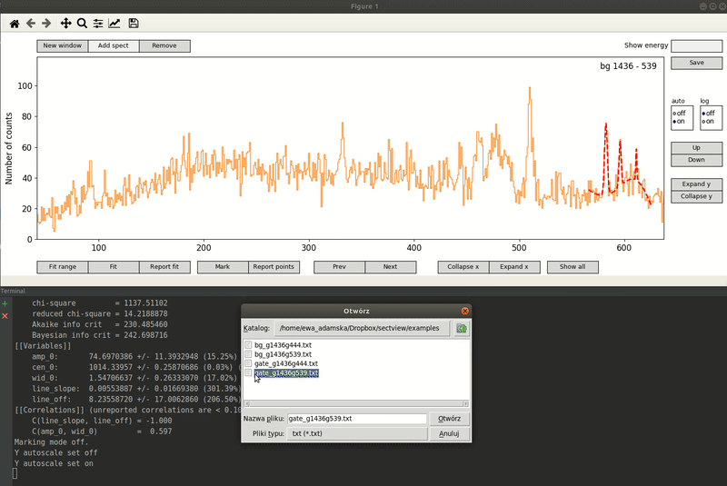

# spectview
Lorem ipsum.

# Dependencies
This application requires the following python3 packages:
* [numpy](http://www.numpy.org/)
* [matplotlib](http://matplotlib.org/)
* [lmfit](https://github.com/newville/lmfit-py)
         
### Dependencies installation
The needed packages can be installed with:
```
pip3 install -r requirements.txt
```
or
```
python3 setup.py build
sudo python3 setup.py install
```

# Usage
